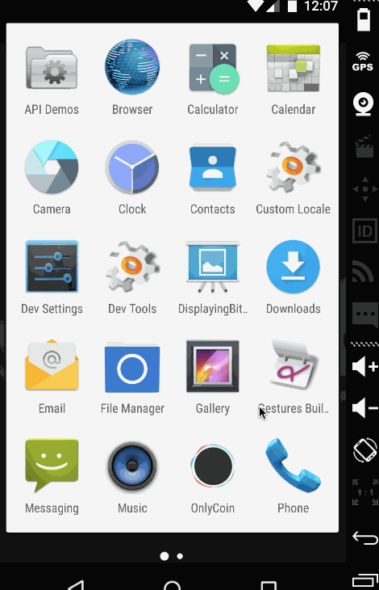

# OnlyCoin
App that displays a list of credit cards for the user

Task                                                                                                                
Create an app that displays a list of credit cards for the user. The list should contain a
sorted list of entries based on creation date, each consisting of a user’s full name, credit
card number, expiration date, and associated background image.

Data Source                                                                                                         
The list of credit cards should be fetched from https://s3.amazonaws.com/mobile.coin.vc/ios/assignment/data.json.
The data can change at any time so be sure to handle deletion & updates. 

Requirements                                                                                                        
* [x] The app should store all the data locally and update any records that have changed                            
* [x] Must not use any third-party libraries (for e.g., ok-http or gson)                                            
* [x] The app should be displayed properly on all Android phones (eg. Nexus 5, Samsung Galaxy series etc)           
* [x] The project must be created on the latest version of Android Studio                                           
* [x] Target for this project should be API Level 18 and above                      

Notes:  
Development:                                                                                                
IDE: Android Studio 1.2.2                                                                                       
minSDK: 18                                                                                                      

 Walkthrough of all user stories:

   
 
 
 GIF created with [LiceCap](http://www.cockos.com/licecap/)
